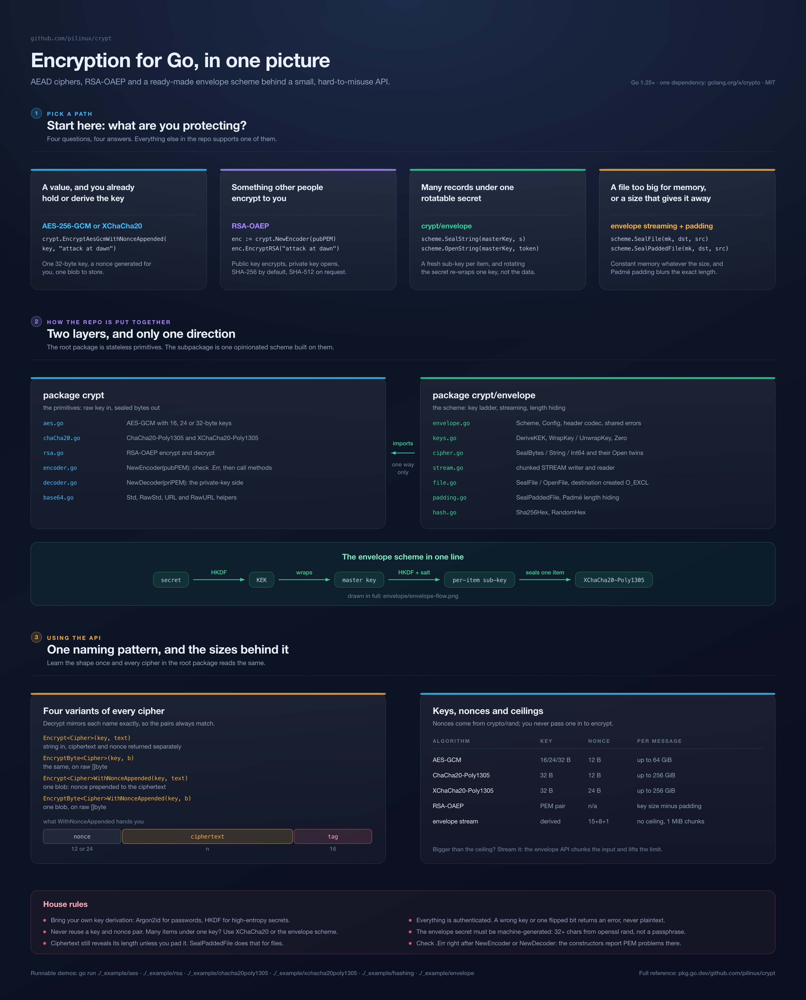

# crypt

Encryption for Go: AES-GCM, ChaCha20-Poly1305, XChaCha20-Poly1305, RSA-OAEP,
and an envelope-encryption package for data at rest.

[![Go Reference][1]][2]
[![DeepWiki][3]][4]
[![CodeQL][5]](https://github.com/pilinux/crypt/actions/workflows/codeql-analysis.yml)
[][6]



## Install

```bash
go get github.com/pilinux/crypt
```

Requires **Go 1.25+**. The only dependency is `golang.org/x/crypto`.

## What to use

| Goal | Use |
| --- | --- |
| Encrypt with a key you already have | AES-256-GCM or XChaCha20-Poly1305 |
| Encrypt a lot of messages under one key | XChaCha20-Poly1305 |
| Let others encrypt data that only you can read | RSA-OAEP |
| Keep many records under one secret you can rotate | [`envelope`](envelope/README.md) |
| Encrypt files too big for memory, or hide their size | [`envelope`](envelope/README.md) streaming and padding |

## Symmetric encryption

```go
// crypt does not derive keys. Here Argon2id turns a passphrase into a
// 32-byte key; keep the salt, you need it to derive the same key again.
salt := make([]byte, 16)
rand.Read(salt)
key := argon2.IDKey([]byte("passphrase"), salt, 2, 64*1024, 2, 32)

ciphertext, err := crypt.EncryptAesGcmWithNonceAppended(key, "attack at dawn")
if err != nil {
	return err
}

plaintext, err := crypt.DecryptAesGcmWithNonceAppended(key, ciphertext)
if err != nil {
	return err // wrong key, or the ciphertext was changed
}
```

Each cipher has the same four encrypt functions, plus the matching `Decrypt`
ones:

| Function | Data | Nonce |
| --- | --- | --- |
| `Encrypt<Cipher>` | `string` | returned separately |
| `EncryptByte<Cipher>` | `[]byte` | returned separately |
| `Encrypt<Cipher>WithNonceAppended` | `string` | stored at the start of the ciphertext |
| `EncryptByte<Cipher>WithNonceAppended` | `[]byte` | stored at the start of the ciphertext |

`<Cipher>` is `AesGcm`, `Chacha20poly1305` or `XChacha20poly1305`. The two
ChaCha ciphers also have `EncryptByte...WithNonceAppendedAAD`, which binds extra
data such as a record ID to the ciphertext without encrypting it.

## RSA

```go
enc := crypt.NewEncoder(publicKeyPEM)
if enc.Err != nil {
	return enc.Err
}
ciphertext, err := enc.EncryptRSA("attack at dawn")

dec := crypt.NewDecoder(privateKeyPEM)
if dec.Err != nil {
	return dec.Err
}
plaintext, err := dec.DecryptRSA(ciphertext)
```

OAEP uses SHA-256 by default. For SHA-512, set `enc.HashAlg = crypt.SHA512` and
the same on `dec`.

The public key has to be a PKIX `PUBLIC KEY` block and the private key a PKCS#8
`PRIVATE KEY` block. OpenSSL produces both public and private keys in the right
format:

```bash
openssl genpkey -algorithm RSA -out private-2048.pem -pkeyopt rsa_keygen_bits:2048
openssl pkey -in private-2048.pem -pubout -out public-2048.pem

openssl genpkey -algorithm RSA -out private-3072.pem -pkeyopt rsa_keygen_bits:3072
openssl pkey -in private-3072.pem -pubout -out public-3072.pem

openssl genpkey -algorithm RSA -out private-4096.pem -pkeyopt rsa_keygen_bits:4096
openssl pkey -in private-4096.pem -pubout -out public-4096.pem
```

`Encoder` and `Decoder` also carry Base64 helpers (`ToBase64Std`,
`ToBase64RawStd`, `ToBase64URL`, `ToBase64RawURL` and the `FromBase64*`
counterparts). They don't use the key, so a zero `Encoder{}` or `Decoder{}`
works.

## Envelope encryption

The [`envelope`](envelope/README.md) package is for apps that store a lot of
encrypted data. A secret from your environment wraps a random master key, and
every item is sealed under its own key derived from that master key. Rotating
the secret means re-wrapping one 32-byte key, not re-encrypting the database.

```go
scheme := envelope.New(envelope.Config{
	KEKLabel:    "myapp:kek:v1", // don't change these once data exists
	SubKeyLabel: "myapp:data-subkey:v1",
})

// Once: create a master key and store it wrapped.
kek, err := scheme.DeriveKEK(os.Getenv("ENCRYPTION_SECRET"))
masterKey, err := envelope.GenerateMasterKey()
wrapped, err := envelope.WrapKey(kek, masterKey) // save this, not masterKey
envelope.Zero(kek)

// Per item. The AAD ties a token to its row, so tokens can't be swapped.
aad := []byte("user:42:email")
token, err := scheme.SealStringAAD(masterKey, "alice@example.com", aad)
email, err := scheme.OpenStringAAD(masterKey, token, aad)
```

`ENCRYPTION_SECRET` must be at least 32 random bytes (`openssl rand -hex 32`),
not a password. The KEK comes from HKDF, which does no stretching, so a weak
secret can be brute-forced from the wrapped key.

It also handles large data:

- **Streaming.** `SealFile`, `SealStream` and `SealWriter` encrypt in chunks
  (1 MiB by default) with constant memory, whatever the size. If chunks are
  reordered, repeated, dropped or cut off, the stream fails to open.
- **Length hiding.** `SealPaddedFile`, `SealPaddedStream` and `SealPaddedAt`
  pad the data before sealing, so the ciphertext size no longer gives away the
  exact file size.

```go
n, err := scheme.SealFile(masterKey, "backup.tar.enc", "backup.tar")
n, err = scheme.OpenFile(masterKey, "restored.tar", "backup.tar.enc")
```

The [envelope README](envelope/README.md) covers the rest: which function to
pick, the wire format, the errors, and what a ciphertext still reveals.

## Security notes

- AES takes a 16, 24 or 32-byte key. ChaCha20 and XChaCha20 take 32 bytes.
- AES-GCM and ChaCha20-Poly1305 use random 96-bit nonces, so keep the number of
  messages per key well below 2^32. XChaCha20 and `envelope` don't have this
  problem.
- A wrong key, changed ciphertext or malformed input (a nonce of the wrong
  length, say) returns an error instead of panicking or returning garbage.
- A single message is limited to about 256 GiB with ChaCha20 and 64 GiB with
  AES-GCM. Use `envelope` streaming for anything bigger.
- Don't use the output of a stream until the call that produced it returns
  without error. A `StreamWriter` is complete only after `Close` succeeds.
- Ciphertext size reveals plaintext size. If that matters, use the padded
  functions in `envelope`.

## Examples

Each folder under [`_example`](_example) is a small program. Run one with
`go run ./_example/<name>`.

- [aes](_example/aes/main.go), [chacha20poly1305](_example/chacha20poly1305/main.go),
  [xchacha20poly1305](_example/xchacha20poly1305/main.go), [rsa](_example/rsa/main.go),
  [hashing](_example/hashing/main.go)
- [envelope](_example/envelope/main.go): the envelope package end to end. With
  `-serve 127.0.0.1:8080` it runs a small upload server instead, for trying
  streaming and padding on real files (`-h` lists the options).

## Development

```bash
go test -race -cover ./...   # unit tests, race detector, coverage
go vet ./...                 # static analysis
golangci-lint run ./...      # aggregate linters
```

## License

MIT. See [LICENSE][6].

[1]: https://pkg.go.dev/badge/github.com/pilinux/crypt
[2]: https://pkg.go.dev/github.com/pilinux/crypt
[3]: https://deepwiki.com/badge.svg
[4]: https://deepwiki.com/pilinux/crypt
[5]: https://github.com/pilinux/crypt/actions/workflows/codeql-analysis.yml/badge.svg
[6]: LICENSE
