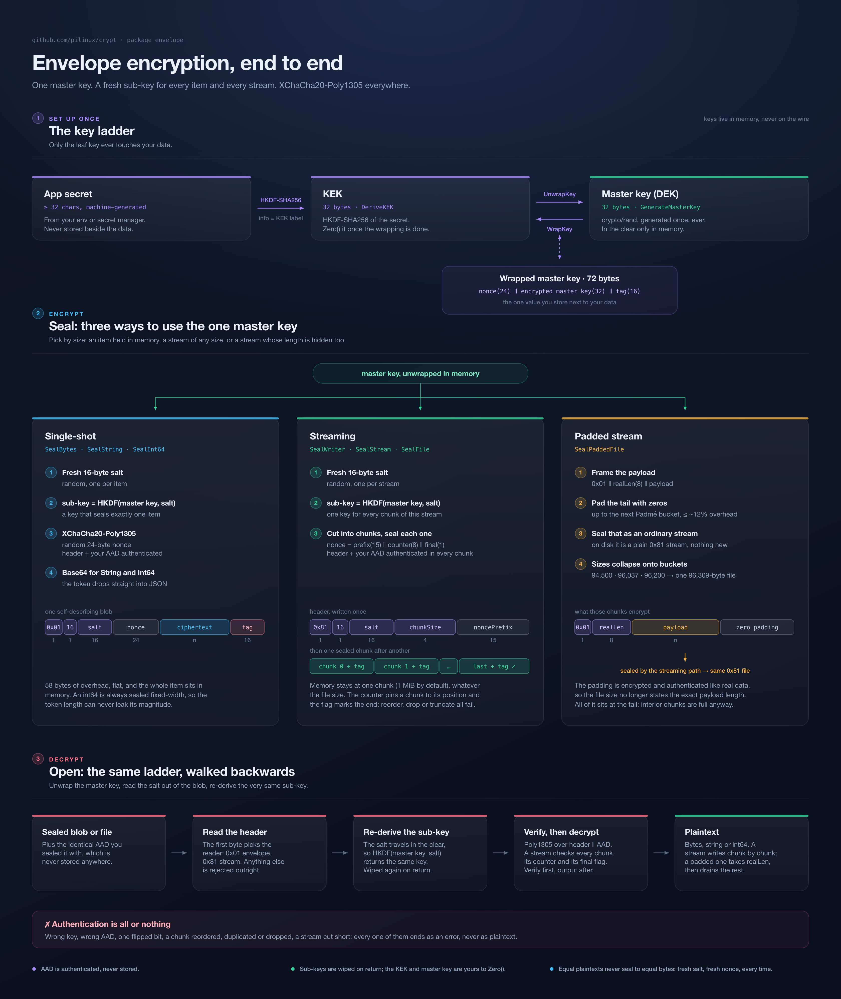

# crypt/envelope

Envelope encryption on top of the root `crypt` primitives.

Key model: `secret --HKDF--> KEK --wraps--> master key --HKDF+salt--> per-item sub-key --> XChaCha20-Poly1305`.

Two formats, told apart by the first byte:

```text
envelope (0x01): version(1) || saltLen(1) || salt(16) || nonce(24) || ciphertext || tag(16)
stream   (0x81): version(1) || saltLen(1) || salt(16) || chunkSize(4 BE) || noncePrefix(15) || chunk...
```

Header (plus caller AAD) is authenticated as AEAD additional data in both. A
stream can carry a padded payload (`version(1) || realLen(8) || payload ||
zeros`, sealed inside the stream) so the file size stops revealing the exact
plaintext length.



The whole scheme on one page: derive the KEK and unwrap the master key, seal
an item, a stream or a padded stream, then walk the same ladder backwards to
open it.

[**Wire format**](#wire-format): the complete byte layout of both formats, with worked examples.

Files: [`envelope.go`](#envelopego) · [`keys.go`](#keysgo) · [`cipher.go`](#ciphergo) · [`stream.go`](#streamgo) · [`file.go`](#filego) · [`padding.go`](#paddinggo) · [`hash.go`](#hashgo) · [tests](#test-files)

---

## Wire format

Every byte the scheme puts on the wire, field by field. All sizes are bytes,
all multi-byte integers are big-endian, and every hex value below comes from a
real run (`go run ./_example/envelope` prints the same dumps, with fresh
random values each time).

### Key hierarchy

Both formats share one key ladder. Only the leaf key ever touches user data.

| Value | Size | Produced by | Lives where |
| --- | --- | --- | --- |
| Application secret | >= 32 chars (`MinSecretLength`) | your own randomness, e.g. `openssl rand -hex 32` | env var / secret manager, never on the wire |
| KEK | 32 (`KeySize`) | `HKDF-SHA256(ikm = secret, salt = nil, info = KEKLabel)` | memory only, `Zero` it after wrapping |
| Master key (DEK) | 32 | `crypto/rand`, generated once ever | stored *wrapped*, see [1](#1-wrapped-master-key-at-rest) |
| Per-item sub-key | 32 | `HKDF-SHA256(ikm = masterKey, salt = 16-byte item salt, info = SubKeyLabel)` | memory only, wiped on return (`defer Zero`) |
| Per-stream sub-key | 32 | same HKDF, **once per stream**, never per chunk | inside the AEAD for the stream's lifetime |

- Public on the wire: version byte, salt length, salt, nonce (or nonce prefix), chunk size, ciphertext, tags.
- Never on the wire: the secret, the KEK, the master key in the clear, any sub-key, the HKDF labels, and the caller-supplied AAD.

### 1. Wrapped master key (at rest)

`WrapKey(kek, masterKey)` is a plain
`crypt.EncryptByteXChacha20poly1305WithNonceAppended` call: no envelope header,
no version byte, no AAD. This is the one value you persist alongside your data.

| Offset | Field | Size | Content |
| --- | --- | --- | --- |
| 0 | nonce | 24 | random, fresh on every wrap |
| 24 | ciphertext | 32 | the master key, encrypted under the KEK |
| 56 | tag | 16 | Poly1305 |
| | **total** | **72** | fixed, always |

Example (hex):

| Part | Value |
| --- | --- |
| KEK (not stored) | `4a70898149320291f112d82f27de499623ec674fa78bcd24faa1f52e7c8c431d` |
| master key (not stored) | `a81998575dbf4d61208267a180ef3adf0ce5deb5645c16537de66382ff4a56b4` |
| nonce | `292a54a73ab81b36fae84305315e352b02832e5f3e3262e6` |
| ciphertext | `6b967eab91be966c974d7da3215716c3429ce4463d11434b1ca141161bfe21bd` |
| tag | `2670c07f7df390442716129b886f9f74` |
| stored blob (base64) | `KSpUpzq4Gzb66EMFMV41KwKDLl8+MmLma5Z+q5G+lmyXTX2jIVcWw0Kc5EY9EUNLHKFBFhv+Ib0mcMB/ffOQRCcWEpuIb590` |

### 2. Single-shot envelope (version `0x01`)

Produced by `SealBytes` / `SealString` / `SealInt64` and their `*AAD` variants.
The whole item is held in memory, sealed under **its own sub-key**, with **one
random nonce**.

```text
┌─────────┬─────────┬──────┬───────┬────────────────┬─────┐
│ version │ saltLen │ salt │ nonce │   ciphertext   │ tag │
│    1    │    1    │  16  │   24  │ len(plaintext) │  16 │
└─────────┴─────────┴──────┴───────┴────────────────┴─────┘
└────── header (18) ───────┘└─ XChaCha20-Poly1305 output ─┘
```

| Offset | Field | Size | Value | Set by |
| --- | --- | --- | --- | --- |
| 0 | version | 1 | `0x01` (`envelopeVersion`) | `buildHeader` |
| 1 | saltLen | 1 | `0x10` = 16 | `buildHeader` |
| 2 | salt | 16 (`SaltSize`) | fresh `crypto/rand` per item | `GenerateSalt` |
| 18 | nonce | 24 (`NonceSize`) | fresh `crypto/rand` per item | root `crypt` helper |
| 42 | ciphertext | `len(plaintext)` | XChaCha20 keystream XOR plaintext | AEAD |
| 42 + n | tag | 16 (`TagSize`) | Poly1305 over ciphertext + AAD | AEAD |

The reader (`unpackEnvelope`) accepts any `saltLen` in `1..255` and takes the
salt length from the blob, so a future salt size still parses; the writer emits
16 today. A blob shorter than `2 + saltLen + 24 + 16` cannot be authentic and is
rejected as `ErrBadEnvelope` before any key is derived.

#### What the AEAD actually gets

| AEAD input | Value | Notes |
| --- | --- | --- |
| key | per-item sub-key (32) | `HKDF-SHA256(masterKey, salt, SubKeyLabel)`, wiped after the call |
| nonce | 24 random bytes | safe at random: XChaCha20's 192-bit nonce makes collisions negligible, and the sub-key is unique per item anyway |
| plaintext | the item | |
| additional data | `header (18) \|\| callerAAD` (`authData`) | authenticated, **not** encrypted, and the caller AAD is **not stored** |

#### Encrypted, authenticated, or neither

| Component | Encrypted | Authenticated | Travels on the wire |
| --- | --- | --- | --- |
| version, saltLen, salt | no | yes, as the leading AAD bytes | yes |
| nonce | no | implicitly: change it and the tag stops verifying | yes |
| caller AAD (record ID, field name, ...) | no | yes | **no**, you must re-supply the identical bytes to open |
| plaintext | yes | yes | as ciphertext |
| tag | n/a | n/a | yes |

#### Sizes

| Quantity | Formula | Worked value |
| --- | --- | --- |
| envelope blob | `58 + len(plaintext)` | 17-byte string → 75 |
| base64 token (`SealString`) | `4 * ceil((58 + n) / 3)` chars | 75 → 100 chars |
| int64 blob | `58 + 8 = 66`, always | token is always 88 chars |
| overhead | 58 bytes flat | 40 of those bytes are salt + nonce, 16 the tag, 2 the version/saltLen pair |

`SealInt64` writes the value as fixed-width 8-byte big-endian two's complement,
so `1` and `-9223372036854775808` produce byte-identical token lengths and the
magnitude cannot leak.

#### Example rows

Sealing the string `alice@example.com` (17 bytes) under the master key above:

| Field | Size | Value |
| --- | --- | --- |
| version | 1 | `01` |
| saltLen | 1 | `10` (= 16) |
| salt | 16 | `2d63c25c4e0f9e0215382a8ada3032d2` |
| nonce | 24 | `66e99fcefa0abcd1733a401415288ab300698d9048c13f00` |
| ciphertext | 17 | `9f3f5b7a8f469be8e306c8459889b5f946` |
| tag | 16 | `316aa610b5858ac4555e8a5b4488391d` |
| blob | 75 | `01102d63c25c4e0f9e0215382a8ada3032d266e99fcefa0abcd1733a401415288ab300698d9048c13f009f3f5b7a8f469be8e306c8459889b5f946316aa610b5858ac4555e8a5b4488391d` |
| token | 100 chars | `ARAtY8JcTg+eAhU4KoraMDLSZumfzvoKvNFzOkAUFSiKswBpjZBIwT8Anz9beo9Gm+jjBshFmIm1+UYxaqYQtYWKxFVeiltEiDkd` |

Sealing the integer `42` with the same master key:

| Field | Size | Value |
| --- | --- | --- |
| version, saltLen | 2 | `01 10` |
| salt | 16 | `df8470903d2a31cf0d15168d3de6ff9b` |
| nonce | 24 | `bc2c3928b66cb8f6f26efd2046e0e49999eca991e9591b85` |
| ciphertext | 8 | `e267784fb0b28538` (the plaintext is `000000000000002a`) |
| tag | 16 | `0b6f3858dbb271a52692d2955420e2ca` |
| token | 88 chars | `ARDfhHCQPSoxzw0VFo095v+bvCw5KLZsuPbybv0gRuDkmZnsqZHpWRuF4md4T7CyhTgLbzhY27JxpSaS0pVUIOLK` |

Sealing the *same* plaintext twice gives a different salt, hence a different
sub-key, hence a different nonce and a completely different blob:

| Run | salt | nonce |
| --- | --- | --- |
| 1 | `06b6d7e597625d246eb8d03137f6511f` | `50b0bf72fcfcfee8d4d07938c6005e4ddc7f279759771c73` |
| 2 | `bdf03c0ca5c6290b16f7f3cc76c48602` | `6f9bb015542bc74d3f5c0659a83e81b2781912a13aababc2` |

There is no deterministic mode: equal plaintexts are never equal ciphertexts,
so the datastore leaks no equality information.

### 3. Streaming format (version `0x81`)

Produced by `SealWriter` / `SealStream` / `SealFile` and their `*AAD` variants.
The input is cut into fixed-size plaintext chunks and each chunk becomes its own
AEAD message. Memory stays at one chunk no matter how large the input is.

```text
┌─────────┬─────────┬──────┬───────────┬─────────────┐┌─────────┬─────────┬─────┬───────────┐
│ version │ saltLen │ salt │ chunkSize │ noncePrefix ││ chunk 0 │ chunk 1 │ ... │ chunk N-1 │
│    1    │    1    │  16  │     4     │      15     ││  ct+tag │  ct+tag │     │   ct+tag  │
└─────────┴─────────┴──────┴───────────┴─────────────┘└─────────┴─────────┴─────┴───────────┘
└─── header (37), authenticated with every chunk ────┘└──── one Poly1305 tag per chunk ─────┘
```

#### Header

| Offset | Field | Size | Value |
| --- | --- | --- | --- |
| 0 | version | 1 | `0x81` (`streamVersion`), high bit set so it can never be mistaken for `0x01` |
| 1 | saltLen | 1 | `0x10` = 16, and the reader requires exactly 16 here |
| 2 | salt | 16 | fresh `crypto/rand`, **one per stream** |
| 18 | chunkSize | 4 | big-endian uint32, plaintext bytes per chunk, must be in `MinChunkSize (1 KiB) .. MaxChunkSize (64 MiB)` |
| 22 | noncePrefix | 15 | fresh `crypto/rand`, **one per stream** |
| | **total** | **37** | `streamHeaderSize` |

The chunk size is read back **from the header**, never from the `Scheme`, so
changing `Config.ChunkSize` later never orphans existing data. `MaxChunkSize`
also bounds the buffer a hostile header can make a reader allocate.

#### Same key, different nonce: what changes per chunk

This is the part that differs most from the single-shot format.

| Per stream (derived once) | Per chunk (changes every chunk) |
| --- | --- |
| salt (16, random) | chunk counter, `0, 1, 2, ...` |
| sub-key (32) = `HKDF-SHA256(masterKey, salt, SubKeyLabel)` | final flag, `0x00` until the last chunk, `0x01` on it |
| nonce prefix (15, random) | the full 24-byte nonce built from those two |
| AEAD instance (`chacha20poly1305.NewX(subKey)`) | the 16-byte tag |
| additional data = `header (37) \|\| callerAAD` | |

**Every chunk of one stream is sealed under the same sub-key.** There is no
per-chunk HKDF, no per-chunk salt and no per-chunk random nonce. Uniqueness
comes from the counter instead, which is exactly what makes chunk reordering
detectable: a chunk's position is baked into its nonce. Across streams the keys
differ anyway, since each stream draws its own salt.

#### Chunk nonce (24 bytes)

| Offset | Field | Size | Content |
| --- | --- | --- | --- |
| 0 | noncePrefix | 15 | from the header, constant for the stream |
| 15 | counter | 8 | big-endian chunk index, starts at 0 |
| 23 | final flag | 1 | `0x00` for every chunk but the last, `0x01` for the last |

Nonce reuse is impossible within a stream (the counter increments) and
practically impossible across streams (a fresh 15-byte prefix *and* a fresh
salt, so a different key entirely).

#### Chunk body

| Part | Size | Notes |
| --- | --- | --- |
| ciphertext | `chunkSize` for every chunk but the last | the last carries the remainder |
| tag | 16 | one Poly1305 tag per chunk, appended by the AEAD |
| chunk on the wire | `plaintext bytes + 16` | non-final chunks are always `chunkSize + 16` |

A chunk shorter than 16 bytes cannot even hold a tag and is rejected as
`ErrBadStream`.

#### How many chunks

`chunks = max(1, ceil(n / chunkSize))`. The writer holds the trailing buffer
back until it knows more data follows (a one-byte look-ahead), so an input that
is an exact multiple of the chunk size does **not** get an extra empty final
chunk; the last full buffer is simply flagged final. An empty input still
produces one chunk: an authenticated 16-byte tag over zero bytes.

Measured, with `chunkSize` = 1 KiB (`MinChunkSize`):

| Plaintext `n` | Chunks | Plaintext per chunk | Sealed size | Breakdown |
| --- | --- | --- | --- | --- |
| 0 | 1 | 0 (final) | 53 | 37 + 0 + 16 |
| 500 | 1 | 500 (final) | 553 | 37 + 500 + 16 |
| 1024 | 1 | 1024 (final) | 1077 | 37 + 1024 + 16 |
| 2048 | 2 | 1024, 1024 (final) | 2117 | 37 + 2048 + 2 × 16 |
| 2500 | 3 | 1024, 1024, 452 (final) | 2585 | 37 + 2500 + 3 × 16 |

#### Sizes and memory

| Quantity | Formula | Worked value |
| --- | --- | --- |
| sealed size | `37 + n + 16 * chunks` | 2500 B at 1 KiB chunks → 2585 |
| overhead | `37 + 16 * ceil(n / chunkSize)` | 10 GiB at the default 1 MiB chunk → 10240 tags = 160 KiB, about 0.0015% |
| memory | one chunk buffer (`chunkSize + 16`), allocated once | 1 MiB by default, whatever the file size |

Bigger chunks trade memory for less tag overhead. Nothing is allocated per
chunk: both buffers are reused and every chunk is sealed and opened in place.

#### Example: 2500 bytes at a 1 KiB chunk size

Header (37 bytes),
`811018f2250d998368c02f22874f359c0024000004006e759a18fea1a1621e3d6bbadd7fb0`:

| Field | Size | Value |
| --- | --- | --- |
| version | 1 | `81` |
| saltLen | 1 | `10` (= 16) |
| salt | 16 | `18f2250d998368c02f22874f359c0024` |
| chunkSize | 4 | `00000400` (= 1024) |
| noncePrefix | 15 | `6e759a18fea1a1621e3d6bbadd7fb0` |

Chunks, all sealed under the one sub-key derived from that salt, all
authenticating the same `header || "report.pdf"` AAD:

| # | Plaintext | Nonce (prefix ‖ counter ‖ flag) | On the wire | Tag |
| --- | --- | --- | --- | --- |
| 0 | 1024 | `6e759a18fea1a1621e3d6bbadd7fb0` `0000000000000000` `00` | 1040 | `fda2e5a001286ea1b6376d9c0be018f2` |
| 1 | 1024 | `6e759a18fea1a1621e3d6bbadd7fb0` `0000000000000001` `00` | 1040 | `24e06be6ade0c3ec2532c36254bce8d0` |
| 2 | 452 | `6e759a18fea1a1621e3d6bbadd7fb0` `0000000000000002` `01` | 468 | `3007794b82748b1ccacc327b52a7253d` |

Total: 37 + 1040 + 1040 + 468 = 2585 bytes.

#### What each attack runs into

| Tampering | Detected by | Error |
| --- | --- | --- |
| flip a ciphertext bit | Poly1305 tag of that chunk | `ErrStreamAuth` |
| edit any header byte (version, salt, chunk size, prefix) | header is AAD of every chunk | `ErrStreamAuth`, or `ErrBadStream` / `ErrInvalidChunkSize` if it no longer parses |
| swap two chunks | counter is in the nonce | `ErrStreamAuth` |
| duplicate a chunk | counter mismatch on the copy | `ErrStreamAuth` |
| drop a chunk | every later counter is off by one | `ErrStreamAuth` |
| truncate the stream | the last chunk read is not flagged final | `ErrStreamAuth`, never a clean EOF |
| append extra chunks | the previously final chunk now decrypts with flag 0 | `ErrStreamAuth` |
| open with the wrong AAD or master key | sub-key / AAD mismatch | `ErrStreamAuth` |
| feed an envelope blob (`0x01`) to the stream reader | version byte | `ErrBadStream` |
| feed a stream blob (`0x81`) to `OpenBytes` | version byte | `ErrBadEnvelope` |

Plaintext is written out chunk by chunk as each chunk authenticates, so a
stream that fails part-way has already produced output: treat the destination
as unusable unless the call returns `nil`. `SealFile` / `OpenFile` remove the
partial destination for you.

### 4. Padded payloads (length hiding)

Both formats above reveal the exact plaintext length. `SealPaddedFile` closes
that gap by framing and padding the payload *before* it reaches the stream
sealer, so the padding is encrypted and authenticated like any other plaintext:

```text
on disk:   0x81 || saltLen || salt || chunkSize || noncePrefix || chunk...
                                                       │
                                    the chunks decrypt to ▼
plaintext: 0x01 || realLen(8, big-endian) || payload || zero padding
```

The file itself is an ordinary `0x81` stream, unchanged. The `0x01` above is
the first byte of the sealed *plaintext*, so it never appears in the clear and
never meets `streamVersion`; it shares a value with `envelopeVersion`
harmlessly, since the two are read from different places.

| Offset | Field | Size | Value |
| --- | --- | --- | --- |
| 0 | version | 1 | `0x01` (`paddingVersion`), first byte of the plaintext, not of the file. A stream sealed without padding is rejected rather than decoded as data |
| 1 | realLen | 8 | payload length as a big-endian uint64: 27 is `00 00 00 00 00 00 00 1b`. Fixed width, so the frame never hints at the size it carries |
| 9 | payload | `realLen` | the file contents |
| 9 + realLen | padding | to the bucket | zero bytes |

**All padding goes at the tail.** Every chunk but the last is already exactly
`chunkSize` bytes of plaintext by construction, and the chunk size is in the
header, so interior chunks carry no length information and padding them would
hide nothing. Whether the padding fills out the final chunk or adds whole
chunks after it is just arithmetic on the bucket size.

#### Bucket policy

`PaddedSize(n)` returns `padme(9 + n)`, the Padmé rule from
[Reducing Metadata Leakage from Encrypted Files](https://petsymposium.org/popets/2019/popets-2019-0056.php)
(PoPETs 2019). It keeps only the top `log2(log2(L))` bits of the length
significant, which caps the overhead near 12%, leaves it around 3% on average,
and collapses every length inside one bucket onto a single size on disk.

Measured with the default 1 MiB chunk size, the first three payloads share a
bucket:

| Payload | `PaddedSize` | Padded file | Unpadded file | Overhead |
| --- | --- | --- | --- | --- |
| 94,500 | 96,256 | **96,309** | 94,553 | 1.9% |
| 96,037 | 96,256 | **96,309** | 96,090 | 0.3% |
| 96,200 | 96,256 | **96,309** | 96,253 | 0.1% |
| 100,000 | 100,352 | 100,405 | 100,053 | 0.4% |

On-disk size is `streamHeaderSize + PaddedSize(n) + TagSize * chunks`, with
`chunks = ceil(PaddedSize(n) / chunkSize)`. The bucket width grows with the
length: 2 KiB near 96 KB, 32 KiB near 1 MB, 16 MiB near 1 GB. That defeats
identifying a known document by its byte count and blurs save-over-save edit
tracking; it is not enough to make a 90 KB file indistinguishable from a 97 KB
one. For that, pad every file in a class to one fixed size and pay for it.

#### Reading it back

`OpenPaddedFile` reads the frame, writes out exactly `realLen` bytes, and then
**drains the rest of the stream**. That last step is not optional: the padding
occupies whole trailing chunks, and only reading to the end authenticates them
and the final-chunk flag. Stopping at the payload would silently accept a
stream truncated inside its padding.

| Situation | Error |
| --- | --- |
| stream sealed without padding, or a frame that does not fit its stream | `ErrNotPadded` |
| source is not a regular file, or changed size while being sealed | `ErrSourceSize` |
| padding chunks removed, reordered or altered | `ErrStreamAuth`, thanks to the drain |

Padding hides the length and nothing else. The file name, the directory, the
mtime and the access pattern all leak independently, and a name like
`salary.xlsx.enc` gives away more than the size ever did. Give sealed files
opaque names (`RandomHex`) and keep the mapping in a sealed column.

### 5. The two formats side by side

| | Single-shot envelope | Stream |
| --- | --- | --- |
| version byte | `0x01` | `0x81` |
| header | 18 bytes (version, saltLen, salt) | 37 bytes (+ chunkSize, noncePrefix) |
| salt | one per **item** | one per **stream** |
| sub-key | one per **item** | one per **stream**, shared by all chunks |
| nonce | 24 random bytes, stored in the blob | derived per chunk: 15-byte stored prefix + counter + flag |
| tags | 1 | one per chunk |
| AEAD additional data | `header(18) \|\| callerAAD` | `header(37) \|\| callerAAD`, identical for every chunk |
| overhead | 58 bytes | `37 + 16 * chunks` |
| memory | whole item | one chunk |
| output | `[]byte`, or base64 for the string/int64 helpers | raw bytes to an `io.Writer` (no base64) |
| entry points | `SealBytes`, `SealString`, `SealInt64` | `SealWriter`, `SealStream`, `SealFile` |

### 6. What an observer of the ciphertext learns

| Visible | Hidden |
| --- | --- |
| that it is a `crypt/envelope` blob, and which of the two formats | the plaintext, the master key, the KEK, the secret, the labels |
| the exact plaintext length (single-shot: `blob - 58`; stream: `sealed - 37 - 16 × chunks`), unless the payload was padded | the magnitude of a sealed int64, and the length of a padded payload to within its Padmé bucket |
| the chunk size of a stream | the caller AAD content, which is never stored (only whether *your* guess of it verifies) |
| the salt, nonce and nonce prefix, none of which are secret | whether two blobs hold the same plaintext: fresh salt and nonce per item make that unlinkable |
| the number of chunks a stream was cut into | which master key sealed it: nothing in the blob identifies the key |

If plaintext length matters for your data, seal files with
[`SealPaddedFile`](#4-padded-payloads-length-hiding). Single-shot tokens are
not padded (`SealInt64` is the one fixed-width case), so pad those yourself
before sealing.

---

## envelope.go

Package doc, shared constants/errors, `Scheme` construction, header codec.

### Constants

- `KeySize` = 32: KEK, master key and sub-key length (XChaCha20 requires 256-bit).
- `SaltSize` = 16: per-item HKDF salt.
- `NonceSize` = 24: XChaCha20-Poly1305 nonce.
- `TagSize` = 16: Poly1305 tag.
- `MinSecretLength` = 32: floor for the app secret. No password stretching, so the secret must be machine-generated.
- `DefaultKEKLabel`, `DefaultSubKeyLabel`: fallback HKDF info labels. Frozen per app, since changing them re-derives different keys and orphans already-sealed data.
- `envelopeVersion` = `0x01`, `envelopeHeaderSize` = 2 (unexported): format tag, plus the version/saltLen byte pair.

### Errors

- `ErrSecretTooShort`: secret shorter than `MinSecretLength`.
- `ErrInvalidKeySize`: key argument is not 32 bytes.
- `ErrInvalidSaltSize`: salt argument is not 16 bytes.
- `ErrBadEnvelope`: blob is not a well-formed envelope (bad version, bad length, bad base64).
- `ErrNotAnInteger`: token authenticates but its plaintext is not the 8-byte int64 encoding.

All generic on purpose, so an HTTP layer can return them without leaking detail.

### Types

- `Config`: `KEKLabel`, `SubKeyLabel`, `ChunkSize`. Empty label falls back to the package default; `ChunkSize` 0 falls back to `DefaultChunkSize`.
- `Scheme`: holds the two labels and the chunk size. Immutable and concurrency-safe; label-dependent operations are methods on it.

### Functions

- `New(cfg Config) *Scheme`: build a `Scheme`, filling empty fields with defaults.
- `Default() *Scheme`: `New(Config{})`, the zero-config path.
- `randomBytes(n)`: n bytes from `crypto/rand`, the one randomness source in the package.
- `buildHeader(salt)`: `version || saltLen || salt`. Rejects a salt outside 1..255 so the length byte cannot overflow.
- `authData(header, aad)`: `header || aad`, the AEAD additional data. A nil or empty aad authenticates the header alone, with no copy made.
- `unpackEnvelope(blob)`: split into header, salt and ciphertext (all aliasing `blob`). Rejects a wrong version byte, a zero salt length, or a blob too short to hold nonce plus tag.

## keys.go

The outer layer: secret to KEK to wrapped master key.

- `(*Scheme) DeriveKEK(secret string)`: HKDF-SHA256 (nil salt, KEK label) to a 32-byte KEK. Rejects a secret under 32 chars. Deterministic, so a rotated secret shows up as an unwrap failure. Wipe with `Zero` after use.
- `GenerateMasterKey()`: 32 random bytes (DEK). Called once, ever.
- `WrapKey(kek, masterKey)`: `crypt.EncryptByteXChacha20poly1305WithNonceAppended(kek, masterKey)`, both args length-checked. This is what gets stored at rest.
- `UnwrapKey(kek, wrapped)`: the reverse. A non-nil error means a wrong KEK (secret changed), tampering, or an authentic plaintext that is not 32 bytes, which is wiped before returning `ErrInvalidKeySize`.
- `Zero(b)`: `clear(b)`, to wipe key material. Best effort. Sub-keys are wiped internally; the KEK and master key are the caller's to wipe.

## cipher.go

Single-shot Seal/Open, holding the whole item in memory. Delegation is always plain → AAD → `SealBytesAAD`/`OpenBytesAAD`.

- `int64WireSize` = 8 (unexported): fixed int64 plaintext width, so token length cannot leak the magnitude.
- `GenerateSalt()`: 16 random bytes, one per item.
- `(*Scheme) DeriveSubKey(masterKey, salt)`: HKDF-SHA256(masterKey, salt, sub-key label) to a 32-byte per-item key. The "smart salt" step: the master key is never an AEAD key, and each item gets its own key, so a nonce can never repeat under one key.

### Bytes

- `SealBytes(masterKey, plaintext)` → `SealBytesAAD(..., nil)`.
- `SealBytesAAD(masterKey, plaintext, aad)`, the core: `GenerateSalt` → `DeriveSubKey` (wiped on return) → `buildHeader` → XChaCha20-Poly1305 with `authData(header, aad)` → `header || nonce || ciphertext || tag`.
- `OpenBytes(masterKey, blob)` → `OpenBytesAAD(..., nil)`.
- `OpenBytesAAD(masterKey, blob, aad)`, the core: `unpackEnvelope` → re-derive the sub-key from the stored salt (wiped on return) → decrypt with the same `authData`. A wrong key, a wrong or missing aad, or any altered byte is an authentication failure.

### String

- `SealString(masterKey, plaintext)` → `SealStringAAD(..., nil)`.
- `SealStringAAD(masterKey, plaintext, aad)` → `SealBytesAAD` → std base64, so the token drops into JSON.
- `OpenString(masterKey, token)` → `OpenStringAAD(..., nil)`.
- `OpenStringAAD(masterKey, token, aad)`: base64 decode (bad base64 gives `ErrBadEnvelope`) → `OpenBytesAAD` → string.

### Int64

- `SealInt64(masterKey, n)` → `SealInt64AAD(..., nil)`.
- `SealInt64AAD(masterKey, n, aad)`: 8-byte big-endian two's complement → `SealBytesAAD` → base64. Every int64 token is the same length.
- `OpenInt64(masterKey, token)` → `OpenInt64AAD(..., nil)`.
- `OpenInt64AAD(masterKey, token, aad)`: base64 decode → `OpenBytesAAD` → require exactly 8 bytes (otherwise `ErrNotAnInteger`, e.g. a token sealed by `SealString`) → int64.

**AAD** (any variant): a record ID, field name, or simply nil; authenticated but neither encrypted nor stored. A different aad means tokens cannot be swapped between rows or fields. The identical bytes must be supplied at decryption.

## stream.go

Chunked STREAM construction for input that does not fit in memory. One sub-key per stream, one nonce per chunk. Nothing is allocated per chunk, which is why the buffers and look-ahead bytes are struct fields.

### Constants and errors

- `DefaultChunkSize` = 1 MiB, `MinChunkSize` = 1 KiB (keeps tag overhead under 2%), `MaxChunkSize` = 64 MiB (caps what a hostile header can make a reader allocate).
- `streamVersion` = `0x81`: high bit set so it can never collide with `envelopeVersion`, and each reader rejects the other's blob up front.
- `streamNoncePrefixSize` = 15, `streamCounterSize` = 8, `streamChunkSizeWidth` = 4, `streamHeaderSize` = 37.
- `ErrInvalidChunkSize`: chunk size (from `Config` or from a header) outside `MinChunkSize`..`MaxChunkSize`.
- `ErrBadStream`: bad header, or a chunk too short to hold a tag.
- `ErrStreamAuth`: chunk failed authentication. Wrong key or aad, modified data, or chunks reordered, duplicated, dropped or truncated.
- `ErrStreamClosed`: `Write` after `Close`.

### Header and nonce helpers

- `buildStreamHeader(salt, chunkSize, noncePrefix)`: assemble the 37-byte cleartext header, validating all three inputs.
- `parseStreamHeader(header)`: validate and split it back into salt, chunk size and nonce prefix (aliasing `header`). The chunk size always comes from the stream, never from the `Scheme`, so changing `Config.ChunkSize` never orphans data.
- `streamNonce(dst, prefix, counter, final)`: `prefix(15) || counter(8 BE) || finalFlag(1)`. The counter pins a chunk to its position and the flag marks the last one, which is what makes reorder, duplicate, drop and truncate authentication failures.
- `(*Scheme) streamAEAD(masterKey, salt)`: `DeriveSubKey` → one long-lived `chacha20poly1305.NewX` AEAD. The local sub-key copy is wiped immediately.

### StreamWriter

- `StreamWriter`: buffers one chunk (`buf`, cap `chunkSize+TagSize` so sealing happens in place) and holds the AEAD, the authenticated `aad`, the nonce prefix, the chunk counter, a `next[1]byte` look-ahead field and a sticky `err`.
- `(*Scheme) SealWriter(masterKey, dst)` → `SealWriterAAD(..., nil)`.
- `(*Scheme) SealWriterAAD(masterKey, dst, aad)`: once per stream, salt plus nonce prefix, `buildStreamHeader`, `streamAEAD`, `authData`, then write the header to `dst`. The ciphertext is only complete after `Close`.
- `(*StreamWriter) Write(p)`: buffer `p`, sealing a full buffer as a non-final chunk when more data follows. The trailing chunk is always held back for `Close`.
- `(*StreamWriter) ReadFrom(r)`: the `io.Copy` fast path. `io.ReadFull` straight into `buf`, then a one-byte look-ahead so a full buffer is only sealed as non-final if something actually follows.
- `(*StreamWriter) Close()`: seals the remainder as the final chunk and wipes `buf`. Idempotent, and it does not close `dst`. Call it only after the whole input went in, otherwise the result is a valid stream of truncated data.
- `(*StreamWriter) state()`: sticky error first, then `ErrStreamClosed`.
- `(*StreamWriter) seal(final)`: `streamNonce` → `aead.Seal(buf[:0], ...)` in place → write → bump counter. A write failure is sticky, so a half-written stream can never be finalized.
- `(*StreamWriter) abort()`: mark closed and wipe, without emitting a final chunk, so a partial stream stays unopenable.

### StreamReader

- `StreamReader`: the mirror image. One ciphertext chunk decrypted in place, `plain` aliasing the decrypted part not yet handed out, a `carry[1]byte` look-ahead field, counter, `final`, and a sticky `err` (`io.EOF` on a clean end).
- `(*Scheme) OpenReader(masterKey, src)` → `OpenReaderAAD(..., nil)`.
- `(*Scheme) OpenReaderAAD(masterKey, src, aad)`: read and validate the header up front (short input gives `ErrBadStream`), rebuild the same AEAD and `authData`, and size `buf` from the header's chunk size.
- `(*StreamReader) Read(p)`: serve from `plain`, decrypting the next chunk when it runs out. A stream that ends without an authentic final chunk fails with `ErrStreamAuth`, not a clean EOF.
- `(*StreamReader) WriteTo(dst)`: the `io.Copy` fast path, draining a whole chunk at a time.
- `(*StreamReader) readChunk()`: carry byte plus `io.ReadFull` → one-byte look-ahead decides `final` → `streamNonce` → `aead.Open(buf[:0], ...)` in place. Any failure is `ErrStreamAuth`.
- `(*StreamReader) fail(err)`: record the terminal state (`io.EOF` means clean) and wipe the buffer.

### One-shot stream helpers

- `(*Scheme) SealStream(masterKey, dst, src)` → `SealStreamAAD(..., nil)`.
- `(*Scheme) SealStreamAAD(masterKey, dst, src, aad)`: `SealWriterAAD` → `ReadFrom` → `Close`, returning the plaintext bytes sealed. On error it calls `abort()`, never `Close`, so a partial `dst` cannot pass as complete.
- `(*Scheme) OpenStream(masterKey, dst, src)` → `OpenStreamAAD(..., nil)`.
- `(*Scheme) OpenStreamAAD(masterKey, dst, src, aad)`: `OpenReaderAAD` → `WriteTo`, returning the plaintext bytes written. Chunks are written as they authenticate, so treat `dst` as unusable unless the call returns nil.

Wire cost: `37 + n + 16*ceil(n/chunkSize)` bytes. Memory: one chunk, whatever the input size.

## file.go

File-to-file wrappers over the streaming API.

- `filePerm` = `0o600`: mode of every file these create.
- `(*Scheme) SealFile(masterKey, dstPath, srcPath)` → `SealFileAAD(..., nil)`.
- `(*Scheme) SealFileAAD(masterKey, dstPath, srcPath, aad)`: `pipeFile` plus `SealStreamAAD`. Size is limited by the filesystem, not memory. A file name makes a natural aad.
- `(*Scheme) OpenFile(masterKey, dstPath, srcPath)` → `OpenFileAAD(..., nil)`.
- `(*Scheme) OpenFileAAD(masterKey, dstPath, srcPath, aad)`: `pipeFile` plus `OpenStreamAAD`. Corruption surfaces part-way through, and the partial output is removed first.
- `pipeFile(dstPath, srcPath, fn)`: open src, create dst with `O_EXCL|0600` (so swapped arguments cannot truncate the source), run `fn`, `Sync`, `Close`, and `os.Remove(dstPath)` on any error. `fn` receives the open `*os.File`, not a plain reader, so `SealPaddedFileAAD` can `Stat` the handle it is about to read.

## padding.go

Length hiding for the streaming API: framing plus tail padding, so the file
size no longer states the exact payload length. See
[the wire format](#4-padded-payloads-length-hiding) for the layout and the
numbers.

- `paddingVersion` = `0x01`, `paddingFrameSize` = 9 (unexported): the frame
  sealed ahead of the payload, `version(1) || realLen(8 BE)`.
- `ErrNotPadded`: the stream authenticates but its plaintext is not a padded
  frame, for example a stream sealed by `SealFile`.
- `ErrSourceSize`: source is not a regular file, or changed size while being
  sealed. Padding is computed from the size up front, so a moving source cannot
  produce a well-formed padded stream.
- `PaddedSize(n)`: the padded plaintext length for an n-byte payload, `padme(9 + n)`.
  Exported so callers can budget storage; returns 0 for a negative or
  unrepresentable n.
- `padme(l)`: rounds l up so only its top `log2(log2(l))` bits are significant.
  Overhead capped near 12%, about 3% on average. An overflow near `MaxInt64`
  leaves the length unpadded rather than wrapping.
- `zeroReader`: an endless run of zeros. The padding is XORed with the
  keystream like real data, so zeros are indistinguishable once sealed.
- `(*Scheme) SealPaddedFile(masterKey, dstPath, srcPath)` → `SealPaddedFileAAD(..., nil)`.
- `(*Scheme) SealPaddedFileAAD(masterKey, dstPath, srcPath, aad)`: `pipeFile` →
  `Stat` the open handle → `sealPaddedStream`. Returns the real payload length,
  not the padded one.
- `(*Scheme) OpenPaddedFile(masterKey, dstPath, srcPath)` → `OpenPaddedFileAAD(..., nil)`.
- `(*Scheme) OpenPaddedFileAAD(masterKey, dstPath, srcPath, aad)`: `pipeFile` plus
  `openPaddedStream`.
- `sealPaddedStream(...)`: `io.MultiReader(frame, src, zeros)` → `SealStreamAAD`,
  then check the sealed total against `PaddedSize` so a source that changed
  size is caught rather than sealed with a lying frame.
- `openPaddedStream(...)`: `OpenReaderAAD` → read the frame → `io.CopyN` the
  payload → **drain the rest**. The drain is what authenticates the
  padding-only trailing chunks and the final-chunk flag; without it a stream
  truncated inside its padding would pass.

## hash.go

Small helpers, unrelated to key derivation.

- `Sha256Hex(data)`: lowercase hex SHA-256. Fingerprint a plaintext before encrypting to verify a later decryption end to end.
- `RandomHex(n)`: n random bytes hex-encoded (2n chars). Unpredictable IDs that double as safe filenames.

## Test files

`go test -race -cover ./...`. Streaming tests use `MinChunkSize` chunks so multi-chunk cases stay cheap.

- `envelope_test.go`: `randomBytes`, header build/unpack round-trip and rejections, label plumbing in `New`/`Default`.
- `keys_test.go`: KEK derivation (determinism, short secret, label separation), master key generation, wrap/unwrap failures, `Zero`.
- `cipher_test.go`: salt generation, sub-key derivation, Seal/Open round-trips and tamper cases for bytes, string and int64, AAD mismatch.
- `stream_test.go`: round-trips and sizes (`sealedSize`), AAD, wrong key, integrity (reorder, duplicate, drop, truncate, bit flip), envelope/stream separation, chunk-size handling, sticky errors both ways, header codec, nonce layout, and `TestStreamAllocationsPerChunk` (1-chunk versus 100-chunk allocations, guarding the no-per-chunk-allocation property).
- `file_test.go`: file round-trip with and without AAD, refusal to overwrite an existing destination, missing source, partial output removed on corruption.
- `padding_test.go`: `PaddedSize` values, monotonicity and the 12% overhead cap, padded round-trips across the chunk boundary cases, AAD, the length-hiding property (three payload sizes, one file size), padding-only truncation caught by the drain, unpadded and malformed frames rejected, irregular source, size mismatch.
- `hash_test.go`: `Sha256Hex` against known digests, `RandomHex` length and uniqueness.
